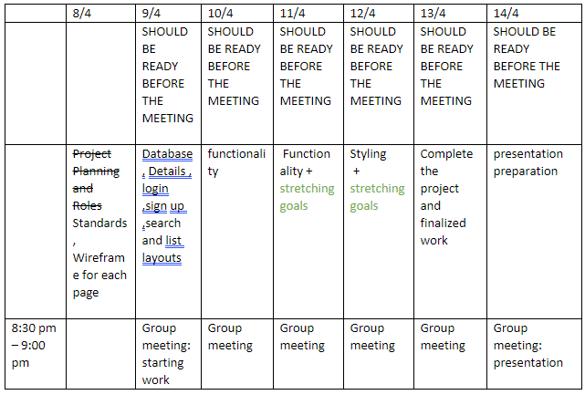
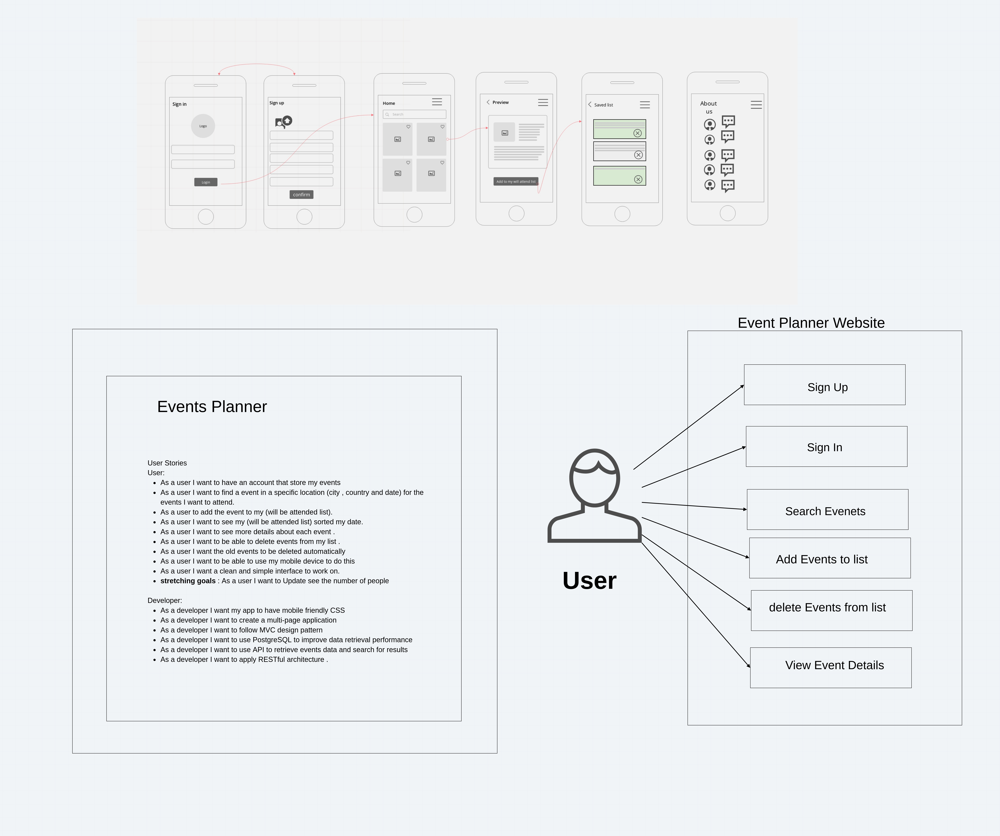
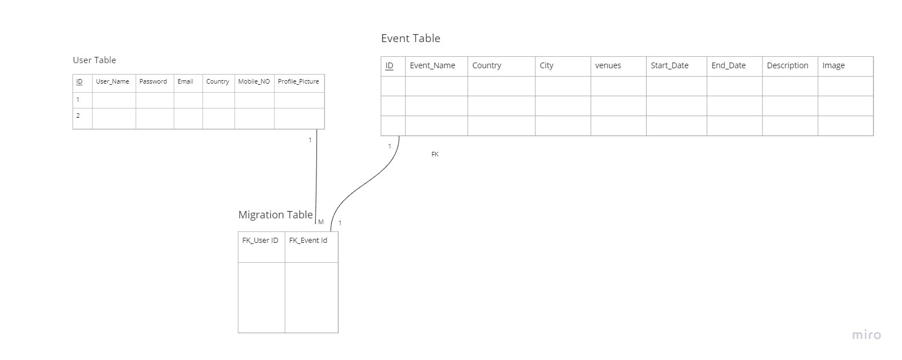

# EventFull

## Project Plan 
 Project Name :

   - EventFull

Team Name :
- Node Titans

Team Members : 

- Manar Abdelkarim  - TL
- Noura Alquran
- Obada Athamneh
- Monther Alkhwaldeh
- Doha Alazzam

### User Stories 

**User:** 

-   As a user I want to have an account that store my events 

-   As a user I want to find a event in a specific location (city , country and date) for the events I want to attend. 

-   As a user to add the event to my (will be attended list). 

-   As a user I want to see my (will be attended list) sorted my date. 

-   As a user I want to see more details about each event . 

-   As a user I want to be able to delete events from my list . 

-   As a user I want the old events to be deleted automatically  

-   As a user I want to be able to use my mobile device to do this  

-   As a user I want a clean and simple interface to work on. 

-   As a user I want to Update see the number of people  

-   Stretching Goals: As a user I want to see the weather

**Developer:**

-   As a developer I want my app to have mobile friendly CSS 

-   As a developer I want to create a multi-page application 

-   As a developer I want to follow MVC design pattern 

-   As a developer I want to use PostgreSQL to improve data retrieval performance 

-   As a developer I want to use API to retrieve events data and search for results 

-   As a developer I want to apply RESTful architecture .

### Work Flow

  **Standards** 

1.  Style (website colors, font styles): [Obada] / except Categories 

2.  Branching and Communication  (GitHub/commits):[Manar] 

3.  Code standards (ex: each function should have illustrative comments):[Noura , Doha] 

4.  Hierarchy File's tree and organizing: [Monther] 

  **Sub-goals:** 

1.  Wireframe for each page [Noura] 

2.  User stories "in read me "[ Manar] 

3.  Events Database [Manar] 

4.  User Database [Noura] 

5.  Database Diagrams [Monther] 

6.  Extensions (About the team):[Doha] 

7.  Sort search events results [Doha] 

8.  Partial (head , header , footer) [Obada] 

9.  Login/sign up [Noura] 

10.  Main Page and Search [Manar], 

11.  Render user event lists and Details [Monther] 

12.  Delete Events from the list [Obada] 

13.  Stretching Goals: delete events after date expired [Obada] 

14.  Stretching Goals: add the API weather 

15. Stretching Goals: user Profile [Monther] 

 **Roles** 

1.  Team Leading and project management [Manar] 

2.  Presentation (Noura) 

 **Timeline**

 

 **The Project Oriented**

 
 **Wire Frame**

 
 **DataBase Diagram**
 
 

