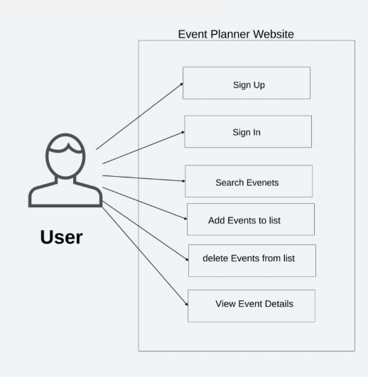
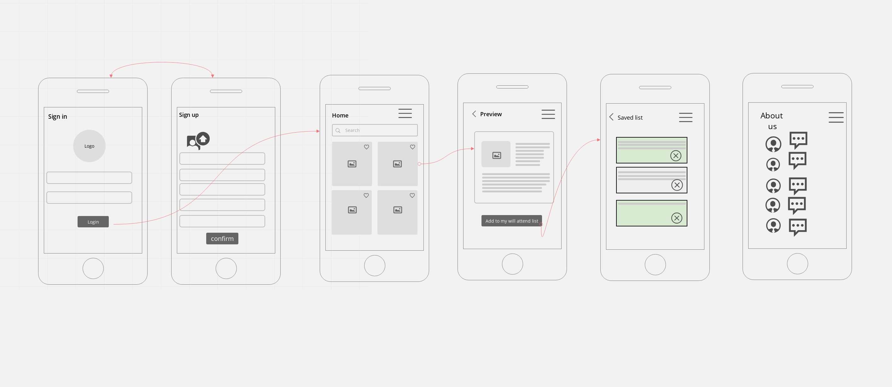

### "version": "1.0.0"

# EventFull

Do you need one website from which you can view all events by the place and date you want?
Our website guarantees that you can find the events you want and save your own list of them arranged by date.
You can also edit your list and delete events that you do not want anymore.
Also, you can see how many people are interested in each event, which helps you choose.

### User Stories 

**User:** 

-   As a user I want to have an account that store my events 

-   As a user I want to find a event in a specific location (city , country and date) for the events I want to attend. 

-   As a user to add the event to my (will be attended list). 

-   As a user I want to see my (will be attended list) sorted my date. 

-   As a user I want to see more details about each event . 

-   As a user I want to be able to delete events from my list . 

-   As a user I want the old events to be deleted automatically  

-   As a user I want to be able to use my mobile device to do this  

-   As a user I want a clean and simple interface to work on. 

-   As a user I want to Update see the number of people  

-   Stretching Goals: As a user I want to see the weather

**Developer:**

-   As a developer I want my app to have mobile friendly CSS 

-   As a developer I want to create a multi-page application 

-   As a developer I want to follow MVC design pattern 

-   As a developer I want to use PostgreSQL to improve data retrieval performance 

-   As a developer I want to use API to retrieve events data and search for results 

-   As a developer I want to apply RESTful architecture .

**What the project will not do:** 
- My website will never allow the user to add events .
- My website will never turn into an IOS or Android app.

**Functional Requirements**

 

- A user can create a profile
- A user can sign in to his profile
- A user can search for events 
- A user can add events to his list
- A user can delete events from his list
- A user can view events to details

**Data Flow**
 

**Non-Functional Requirements**

- Security: The bcrypt hashing function allows us to build a password security platform that scales with computation power and always hashes every password with a salt. 
- Flexibility : the menu is shown in every page so the user can navigate easily between pages 